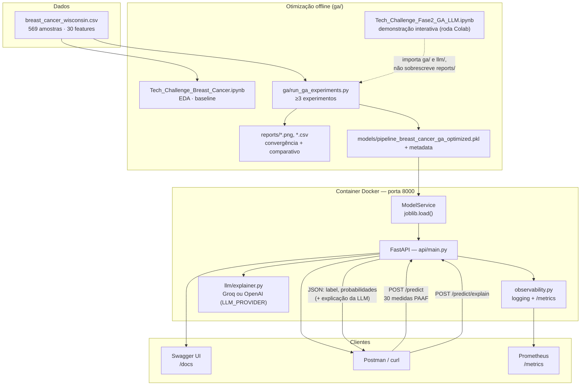
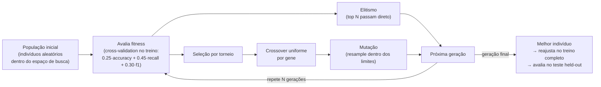
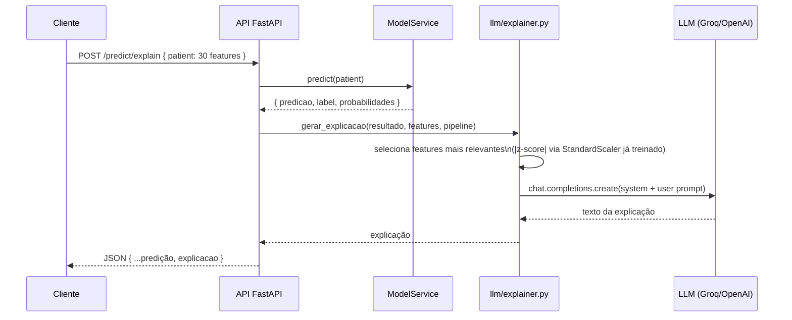
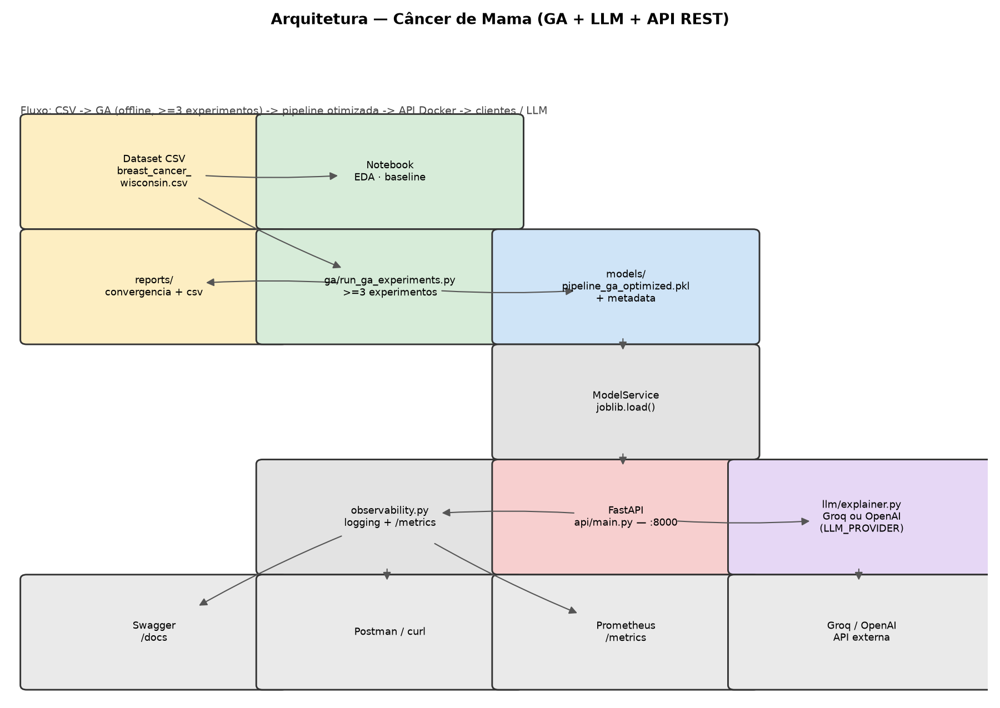

# Arquitetura do Sistema — Tech Challenge Fase 2 (Projeto 1)

Sistema de apoio à decisão para classificação **benigno/maligno** em amostras de câncer
de mama (Breast Cancer Wisconsin), agora com hiperparâmetros otimizados via
**algoritmo genético** e explicações em linguagem natural via **LLM**.

## Visão geral

## Fluxo do algoritmo genético

Rodado pra `logistic_regression` (modelo em produção na Fase 1) e `random_forest`
(espaço de busca mais rico), em ≥3 configurações de GA (tamanho de população, taxa de
mutação) — ver `ga/run_ga_experiments.py` e os resultados em `reports/`.

## Fluxo de explicação via LLM

O provedor é configurável via `LLM_PROVIDER=groq|openai` (default `groq`, que expõe uma
API compatível com a da OpenAI e serve Llama 3 de graça — ver `llm/explainer.py`). Se a
chamada à LLM falhar (sem API key do provedor escolhido, rate limit, rede), a API
responde `503` — o `/predict` original nunca é afetado, é uma rota totalmente separada.

## Componentes

| Camada | Arquivo / tecnologia | Responsabilidade |
|--------|----------------------|------------------|
| Dados | `breast_cancer_wisconsin.csv` | Dataset UCI/Kaggle com medidas de núcleos celulares |
| Análise e ML (baseline) | `Tech_Challenge_Breast_Cancer.ipynb` | EDA, comparação de modelos, serialização (Fase 1, sem alteração) |
| Otimização | `ga/` (`search_space.py`, `individual.py`, `operators.py`, `fitness.py`, `genetic_algorithm.py`, `run_ga_experiments.py`) | Algoritmo genético de hiperparâmetros |
| Demonstração interativa | `Tech_Challenge_Fase2_GA_LLM.ipynb` | Importa `ga/`/`llm/` e roda célula a célula (roda no Colab); não gera os artefatos oficiais, só demonstra |
| Pipeline | `sklearn` + `joblib` | Imputer → Scaler → Classificador (hiperparâmetros do GA) |
| LLM | `llm/` (`prompts.py`, `explainer.py`, `evaluation.py`) | Explicação em linguagem natural + avaliação de qualidade |
| API | `api/main.py`, `api/schemas.py` | Endpoints REST e validação de entrada |
| Serviço ML | `api/model_service.py` | Carrega `.pkl` (otimizado, com fallback pro original) e executa predição |
| Observabilidade | `api/observability.py` | Logging estruturado + métricas Prometheus (`/metrics`) |
| Container | `Dockerfile`, `docker-compose.yml` | Empacota API + modelos para deploy |
| Testes | `tests/` (pytest) | API, ModelService, operadores/fitness do GA, explainer (LLM mockada) |

## Endpoints

| Método | Rota | Função |
|--------|------|--------|
| GET | `/health` | Verifica API e modelo carregado |
| GET | `/metadata` | Retorna features e metadados do modelo |
| GET | `/metrics` | Métricas Prometheus (latência, contagem de requests) |
| POST | `/predict` | Classificação benigno/maligno |
| POST | `/predict/explain` | Classificação + explicação em linguagem natural (LLM) |

## Escalabilidade e observabilidade

**Implementado:**
- Logging estruturado por request (`api/observability.py`) — label previsto, confiança
  e latência; nunca os dados clínicos crus da amostra.
- Métricas Prometheus via `prometheus-fastapi-instrumentator`, expostas em `/metrics`
  sem middleware customizado.
- Logging do próprio processo de otimização (`ga/genetic_algorithm.py`) — melhor
  fitness e fitness médio por geração, pra acompanhar convergência.

**Proposta (não implementada — decisão consciente de foco no obrigatório):**
Em produção de verdade, a API rodaria atrás de um load balancer com auto-scaling por
CPU/latência — por exemplo AWS ECS Fargate (ou Azure Container Apps) com uma
**target-tracking scaling policy** baseada na métrica de latência p95 que o
`/metrics` já expõe, escalando de 1 a N réplicas conforme a demanda. O `/predict/explain`
teria um scaling separado do `/predict` (latência e custo bem diferentes, por causa da
chamada externa à LLM), possivelmente com fila assíncrona em vez de request síncrono
pra picos de uso. Infraestrutura como código (Terraform/CDK) provisionaria o cluster,
o load balancer e as scaling policies — não implementado nesta entrega.

## Decisões de arquitetura

1. **Pipeline única serializada** — mesmo pré-processamento no treino (GA e notebook) e
   na API, evitando divergência treino/produção.
2. **Outbox de comparação, não substituição** — a pipeline original da Fase 1
   (`pipeline_breast_cancer.pkl`) continua no repositório; `ModelService` serve a
   otimizada por padrão mas cai pra original se o experimento do GA ainda não rodou,
   pra API nunca ficar fora do ar.
3. **`/predict/explain` separado do `/predict`** — quem só precisa da classificação não
   paga a latência/custo/dependência externa da LLM.
4. **Fitness pondera recall mais que accuracy** — falso negativo (maligno classificado
   como benigno) é o erro mais grave nesse contexto clínico.
5. **FastAPI** — documentação OpenAPI automática (Swagger) e validação com Pydantic.
6. **Docker** — ambiente reproduzível para avaliação e entrega.
7. **Separação de camadas** — `main.py` (HTTP), `model_service.py` (ML), `schemas.py`
   (contrato de dados), `ga/` e `llm/` como pacotes independentes, testáveis sem subir a API.

